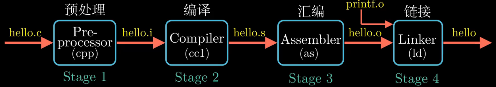

参考视频：https://www.bilibili.com/video/BV1cD4y1D7uR


```
vim hello.c
```

```c
#include <stdio.h>
int main(){
    printf("你好，世界\n");
    return 0;
}
```

编译

```
gcc -o hello hello.c
```


hello.c的表示方法说明了一个基本思想:系统中所有的信息一包括磁盘文件、内存中的程序、内存中存放的用户数据以及网络上传送的数据，都是由`一串比特`表示的。




## CPU

PC

```ruby
PC就是一个4字节或者8字节的存储空间，存放的是某一条指令的地址。从系统上电开始，处理器就不断地在执行PC指向的指令。然后更新PC,使其指向下一条要执行的指令
```


内存/主存

```ruby
内存可以看成一个从零开始的大数组，每个字节都有相应地址。更多细节在第6章
```


