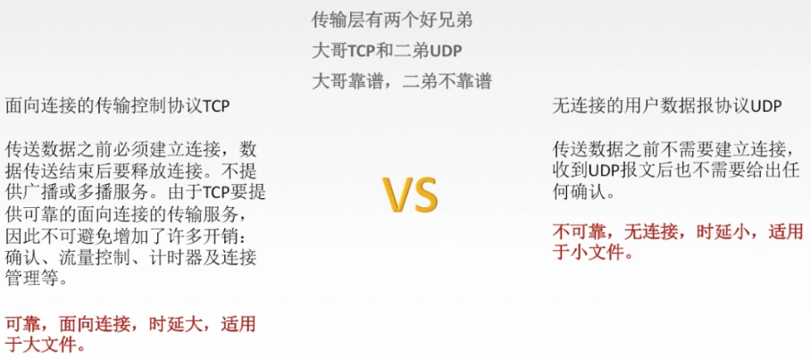
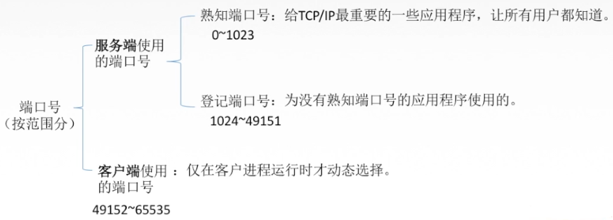
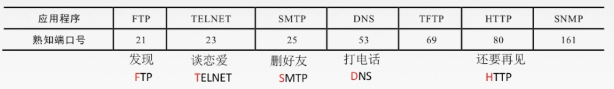
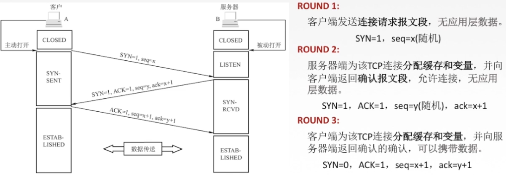

# 传输层

传输层提供了进程与进程之间的逻辑通信

## 传输层的寻址与端口

- 复用：应用层所有的应用进程都可以通过传输层再传输到网络层。
- 分用：传输层从网络层收到数据后交付指明的应用进程。

逻辑端口/软件端口端口是传输层的SAP，标识主机中的应用进程。

>端口号只有本地意义，在因特网中不同计算机的相同端口是没有联系的。
>
>端口号长度为16bit，能表示65536 个不同的端口号。

在网络中采用发送方和接收方的套接字组合来识别端点，套接字唯一标识了网络中的-一个主机和它上面的一个进程。
$$
套接字Socket= (主机IP地址，端口号)
$$

## TCP

TCP必须要建立连接之后才可以进行数据交换，所以TCP是面向连接的

### TCP连接管理:phone:

TCP连接传输共3个阶段

TCP连接的建立采用客户服务器方式，主动发起连接建立的应用进程叫做客户，而被动等待连接建立的应用进程叫服务器。

#### 三次（报文）握手四次挥手

### 流量控制

### 拥塞控制

## UDP

不可靠，无连接

QQ/微信等使用的就是UDP协议