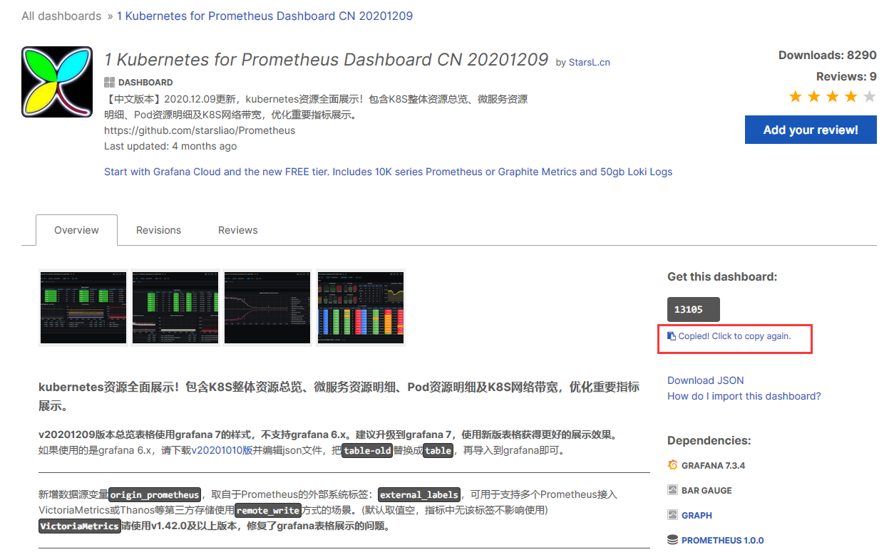
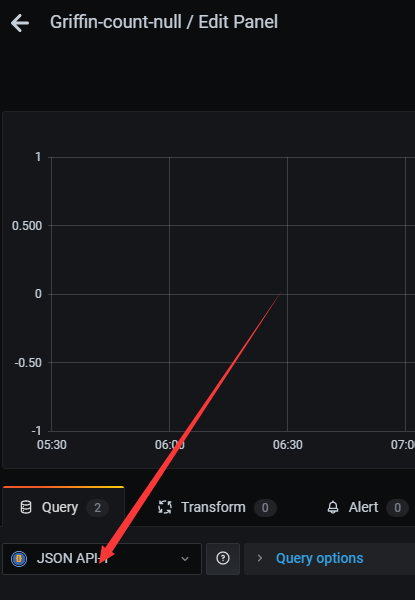

# 从0开始搭建Prometheus+Grafana

Exporter（如node_exporter）在服务器上启动，然后通过端口将数据指标暴露给Prometheus，Prometheus定时拉取数据，Grafana可以配置Prometheus的数据源，再加上不同的dashbord模板，可视化这些数据并进行分析。


安装教程：https://www.yuque.com/markus/hon7gx/nedufb

使用教程！：https://www.cnblogs.com/guoxiangyue/p/11772717.html

监控教程：https://blog.csdn.net/qq_37128049/article/details/108143110

## Prometheus

>中文普罗米修斯，全链路实时监控

下载：https://prometheus.io/download/


创建prometheus用户

```text
useradd prometheus
passwd prometheus

# 授予sudo权限
visudo
prometheus    ALL=(ALL)    NOPASSWD:ALL
```


在tsingdata03的/opt/software

```
wget https://github.com/prometheus/prometheus/releases/download/v2.27.1/prometheus-2.27.1.linux-amd64.tar.gz
```


```
tar -zxvf prometheus-2.27.1.linux-amd64.tar.gz -C /opt/module/
```

启动

```
./prometheus --config.file=prometheus.yml &
```

访问：http://192.168.28.118:9090/


prometheus.yml 文件配置如下，最重要的东西！

```
cd /opt/module/prometheus
vim prometheus.yml
```


```yaml
# my global config
global:
  scrape_interval:     15s # Set the scrape interval to every 15 seconds. Default is every 1 minute.
  evaluation_interval: 15s # Evaluate rules every 15 seconds. The default is every 1 minute.
  # scrape_timeout is set to the global default (10s).

# Alertmanager configuration
alerting:
  alertmanagers:
  - static_configs:
    - targets:
      # - alertmanager:9093

# Load rules once and periodically evaluate them according to the global 'evaluation_interval'.
rule_files:
  # - "first_rules.yml"
  # - "second_rules.yml"

# A scrape configuration containing exactly one endpoint to scrape:
# Here it's Prometheus itself.
scrape_configs:
  # The job name is added as a label `job=<job_name>` to any timeseries scraped from this config.
  - job_name: 'prometheus'

    # metrics_path defaults to '/metrics'
    # scheme defaults to 'http'.

    static_configs:
    - targets: ['192.168.28.116:8001']

```

核心点就是上面的` targets`，相信很多分析类的文章都没有提到。

重新启动

```
./prometheus --config.file=prometheus.yml &
```


## Grafana

https://dl.grafana.com/oss/release/grafana-7.5.7-1.x86_64.rpm

```
sudo yum install grafana-7.5.7-1.x86_64.rpm
```

启动

```
sudo service grafana-server start
```

使用下面命令检查是否启动成功

```
sudo service grafana-server status
```

访问：http://192.168.28.118:3000/

```
admin
admin
```


设置prometheus连接grafana


新建仪表盘


无密码登录

```
vim /etc/grafana/grafana.ini
```

将配置文件中的auth.anonymous的enabled设置为true就可以匿名登录，不用输入用户名和密码

```
#################################### Anonymous Auth ######################
[auth.anonymous]
# enable anonymous access
;enabled = true

# specify organization name that should be used for unauthenticated users
;org_name = Main Org.

# specify role for unauthenticated users
;org_role = Viewer

# mask the Grafana version number for unauthenticated users
;hide_version = false
```


卸载

```
grafana-cli plugins uninstall raintank-worldping-app
```


## Node_exporter

>[NodeExporter](https://link.zhihu.com/?target=https%3A//github.com/prometheus/node_exporter)可以暴露很多和硬件/软件相关的指标(metrics)。

```
https://github.com/prometheus/node_exporter/releases/download/v1.1.2/node_exporter-1.1.2.linux-amd64.tar.gz
```


解压安装

```
tar -zxvf node_exporter-1.0.1.linux-amd64.tar.gz -C /opt/module/
```


改名

```
mv node_exporter-1.0.1.linux-amd64 node_exporter

cd node_exporter
```

启动服务

```
nohup ./node_exporter & 
```

如果一切顺利你会看到类似下面的输出，默认端口是`9100`

访问：http://192.168.28.118:9100/


将 node_exporter 服务加入到 Prometheus 的监控列表

```
cd /opt/module/prometheus
```

在 prometheus.yml 末尾添加如下内容，将IP地址换成你的 node_exporter 节点的实际地址即可。

```yml
- job_name: 'node'

   static_configs:

   - targets: ['192.168.28.118:9100']
```

```
./prometheus --config.file=prometheus.yml &
```

访问：http://192.168.28.118:9090/targets


## Dashboard

模板：https://grafana.com/grafana/dashboards 

### 第一个模板

翻到下面




我这里就是下面这个数字

```
13105
```

或者下载JSON，可以不用


 然后打开我们的Grafana监控页面，打开dashboard的管理页面


 点击【import】按钮


 然后将我们刚才的复制的dashboard Id 复制进去


 Grafana会自动识别dashboard Id 。

然后点击【change】按钮，生成一个随机的UID，然后点击下方输入框，选择我们之前创建的数据源Prometheus，最后点击【Import】按钮，即可完成导入。


 导入成功后，会自动打开该Dashboard，即可看到我们刚才设置好的node监控


### 第二个模板

https://grafana.com/grafana/dashboards/8919

此模板需要配置，我们这边监控多台服务器，其他机器也需要操作node_exporter的步骤，需要让他们跑起来。

然后再配置

```yml
# my global config
global:
  scrape_interval:     15s # Set the scrape interval to every 15 seconds. Default is every 1 minute.
  evaluation_interval: 15s # Evaluate rules every 15 seconds. The default is every 1 minute.
  # scrape_timeout is set to the global default (10s).

# Alertmanager configuration
alerting:
  alertmanagers:
  - static_configs:
    - targets:
      # - alertmanager:9093

# Load rules once and periodically evaluate them according to the global 'evaluation_interval'.
rule_files:
  # - "first_rules.yml"
  # - "second_rules.yml"

# A scrape configuration containing exactly one endpoint to scrape:
# Here it's Prometheus itself.
scrape_configs:
  # The job name is added as a label `job=<job_name>` to any timeseries scraped from this config.
  - job_name: 'prometheus'

    # metrics_path defaults to '/metrics'
    # scheme defaults to 'http'.

    static_configs:
    - targets: ['192.168.28.118:8001']

  - job_name: 'node'
    static_configs:
    - targets: ['192.168.28.118:9100','192.168.28.117:9100','192.168.28.116:9100']
```


## Grafana监控系统之ElasticSearch

参考：https://www.cnblogs.com/wxwall/p/9642621.html

以 Griffin 为例，其中 tmst 是必填的，在http://192.168.28.116:9200/griffin找到对应的时间格式


## Grafana监控系统之API

右键检查，NetWork，刷新网页，找到对应的API接口，如

```
http://192.168.28.116:8085/api/v1/metrics/values?metricName=null_count&size=300&offset=0
```


#### 在本地 Grafana 上安装：

对于本地实例，通过简单的 CLI 命令安装和更新插件。插件不会自动更新，但是当您的 Grafana 中有可用更新时，您会收到通知。

##### 安装数据源

使用 grafana-cli 工具从命令行安装 JSON API：

```
grafana-cli plugins install marcusolsson-json-datasource
```

该插件将安装到您的 grafana 插件目录中；默认为 /var/lib/grafana/plugins。[有关 cli 工具的更多信息](https://grafana.com/docs/grafana/latest/administration/cli/#plugins-commands)。

或者，您可以手动[下载 .zip 文件](https://grafana.com/api/plugins/marcusolsson-json-datasource/versions/1.2.0/download)并将其解压到您的 grafana 插件目录中。

#### 重启

```
service grafana-server restart
```

#### 打开Grafana

添加数据源


添加看板




## Grafana监控系统之邮件报警

监控教程：https://blog.csdn.net/qq_37128049/article/details/108143110

```
vim /etc/grafana/grafana.ini
```

修改

> 分号也是注释的意思

```
[smtp]
enabled = true  #是否允许开启
host = smtp.exmail.qq.com:465    #发送服务器地址，可以再邮箱的配置教程中找到：
user = 你的邮箱
# If the password contains # or ; you have to wrap it with trippel quotes. Ex """#password;"""
# 这个密码是你开启smtp服务生成的密码
password = 你的密码
;cert_file =
;key_file =
;skip_verify = false
from_address = 你的邮箱
from_name = Grafana
# EHLO identity in SMTP dialog (defaults to instance_name)
ehlo_identity = dashboard.example.com
[emails]
;welcome_email_on_sign_up = true
#################################### Logging ##########################
```

重启

```
service grafana-server restart
```


